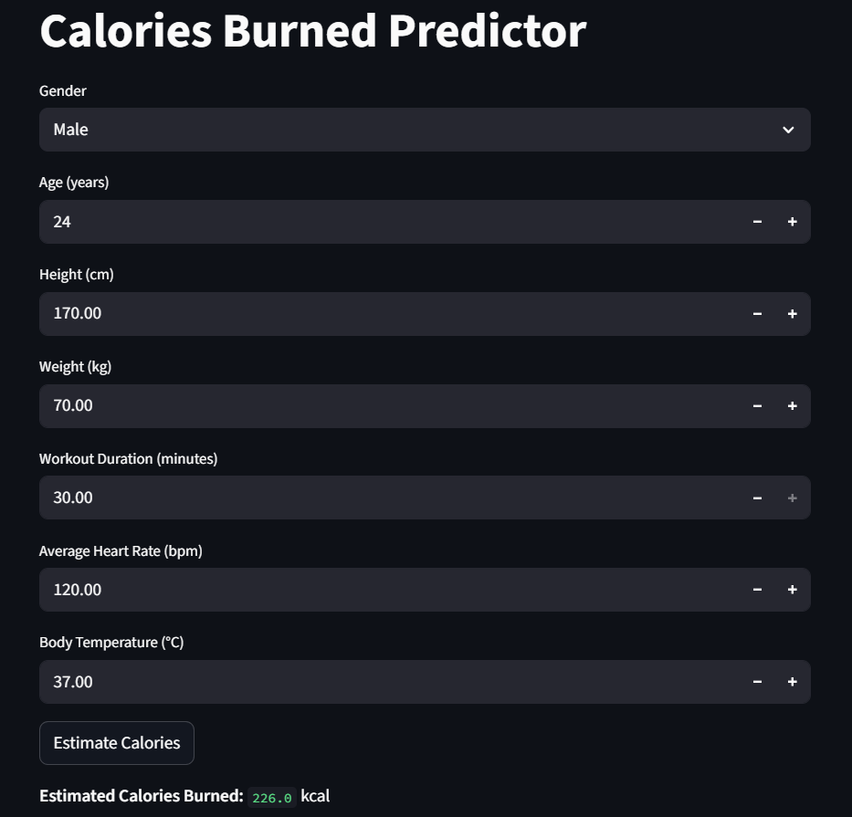

# Calorie Burned Predictor (Machine Learning Project)

This project is a web app built using Python, Streamlit, and Machine Learning.  
It predicts how many calories a person burns during a workout based on their personal details and activity data.

The model was trained using a Random Forest Regressor and gives accurate results with a Mean Absolute Error (MAE) of around 2 kcal and an R² score of about 0.998.

---

## How it Works
The dataset used for training includes features like:
- Gender  
- Age  
- Height  
- Weight  
- Workout Duration  
- Heart Rate  
- Body Temperature  

The Random Forest model from scikit-learn was used for training.  
Once trained, the model can predict how many calories a person burns during a workout.  
The app provides an easy-to-use Streamlit interface where users can enter their details and instantly get a prediction.

---

## Technologies Used
- Python  
- Pandas  
- Scikit-learn  
- Streamlit  
- Joblib  

---

## Model Details
- Algorithm: Random Forest Regressor  
- MAE: ~2 kcal  
- R²: 0.998  
- The dataset’s maximum workout duration is 30 minutes, so predictions are limited to that range.

---

## How to Run

To run the app on your local computer, follow these steps:

1. **Clone the repository**
   ```bash
   git clone https://github.com/24prathameshmote-rgb/calorie-burned-predictor-ml.git
   ```
   
2. **Go into the project folder**
   ```bash
   cd calorie-burned-predictor-ml
   ```

3. **Install required dependencies**
    ```bash
   pip install -r requirements.txt
   ```

4. **Run the Streamlit app**
   ```bash
   python -m streamlit run app.py
   ```

Once the app starts, it will open automatically in your web browser.
You can enter your details (gender, age, height, weight, duration, heart rate, and body temperature) and get your calorie burn estimate.

---

## Screenshot of the UI


---

**Dataset Information**

The dataset used for training this model is from Kaggle:
[Calories Burnt Prediction Dataset](https://www.kaggle.com/datasets/ruchikakumbhar/calories-burnt-prediction)

License: CC0 1.0 Universal (Public Domain) license.
The dataset includes information like gender, age, height, weight, workout duration, heart rate, and body temperature, which are used to predict the number of calories burned during exercise.
